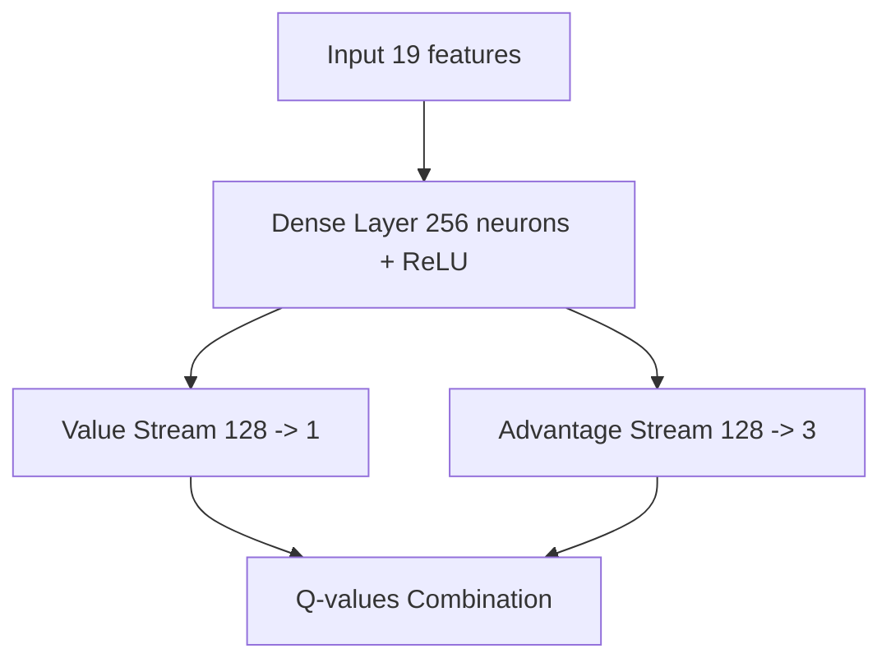

# Snake AI with Deep Reinforcement Learning 🐍🤖

Un projet d'Intelligence Artificielle qui apprend à jouer au jeu Snake en utilisant le Deep Q-Learning (DQN) avec PyTorch.


## 📋 Table des matières

- [Aperçu du projet](#-aperçu-du-projet)
- [Fonctionnalités](#fonctionnalités)
- [Architecture technique](#%EF%B8%8F-architecture-technique)
- [Installation](#-installation)
- [Utilisation](#-utilisation)
- [Résultats](#-résultats)
- [Améliorations futures](#-améliorations-techniques-apportées)
- [Auteurs](#-auteur)

## 🎯 Aperçu du projet

Ce projet implémente un agent d'apprentissage par renforcement capable d'apprendre à jouer au jeu Snake de manière autonome. L'agent utilise une architecture **Dueling DQN (Deep Q-Network)** pour prendre des décisions optimales et maximiser son score.

### Fonctionnalités principales

- **Architecture Dueling DQN** : Séparation de la fonction de valeur et de l'avantage pour un apprentissage plus stable.
- **Experience Replay** : Mémorisation et échantillonnage aléatoire des expériences passées.
- **Target Network** : Réseau cible mis à jour périodiquement pour stabiliser l'apprentissage.
- **Epsilon-Greedy** : Stratégie d'exploration-exploitation avec décroissance progressive.
- **Reward Shaping** : Système de récompenses sophistiqué pour guider l'apprentissage.

## 🎮 Gameplay

L'agent apprend progressivement à naviguer dans l'environnement. Voici des exemples de l'agent en action :

<p align="center">
  
  
</p>

## 🏗️ Architecture technique

### Réseau de neurones



### État du jeu (19 features)

1.  **Détection des dangers (8)** : Obstacles dans 8 directions (haut, bas, gauche, droite, diagonales).
2.  **Danger immédiat (1)** : Collision dans la direction actuelle.
3.  **Direction actuelle (4)** : Encodage one-hot de la direction.
4.  **Position relative de la nourriture (6)** : Coordonnées normalisées et directions booléennes.

### Actions possibles

- `[1, 0, 0]` : Continuer tout droit
- `[0, 1, 0]` : Tourner à droite
- `[0, 0, 1]` : Tourner à gauche

### Système de récompenses

| Événement | Récompense |
| :--- | :--- |
| Manger la nourriture | **+20** |
| Se rapprocher de la nourriture | **+1** |
| S'éloigner de la nourriture | **-1** |
| Rester immobile | **-0.5** |
| Collision (Game Over) | **-15** |
| Timeout sans nourriture | **-10** |
| Pénalité progressive (>50 steps sans nourriture) | **-0.1 × (steps - 50)** |

## 📦 Installation

### Prérequis

- Python 3.8+
- pip

### Dépendances

```bash
pip install pygame numpy torch matplotlib
```

### Cloner le repository

```bash
git clone https://github.com/votre-username/snake-ai.git
cd snake-ai
```

## 🚀 Utilisation

### Mode Entraînement

Pour entraîner un nouveau modèle :

```bash
python SnakeRL.py
# Choisir l'option 1
```

L'entraînement créera automatiquement :
- Un dossier `models/snake_ai_YYYYMMDD_HHMMSS/`
- Sauvegardes automatiques tous les 100 épisodes
- Sauvegarde du record à chaque amélioration

### Mode Démonstration

Pour tester un modèle entraîné :

```bash
python SnakeRL.py
# Choisir l'option 2
# Entrer le chemin du modèle (ex: models/snake_ai_20260115_123000/model_record_38.pth)
```

### Paramètres d'entraînement

Ces hyperparamètres sont modifiables dans le code :

```python
MAX_MEMORY = 100_000     # Taille du buffer de replay
BATCH_SIZE = 1024        # Taille des mini-batches
LR = 0.0005              # Learning rate
GAMMA = 0.95             # Facteur de discount
EPSILON_START = 1.0      # Exploration initiale
EPSILON_END = 0.01       # Exploration minimale
EPSILON_DECAY = 0.995    # Décroissance de l'exploration
TARGET_UPDATE = 10       # Fréquence de mise à jour du target network
```

## 📊 Résultats

### Métriques d'entraînement


Après **561 épisodes** :
- **Meilleur score** : 38 🏆
- **Score moyen** : 8.71
- **Epsilon final** : 0.010 (exploration minimale atteinte)

### Progression de l'apprentissage

Le graphique ci-dessous montre l'évolution des performances :


1.  **Phase d'exploration** (0-100 épisodes) : Scores faibles, l'agent explore aléatoirement.
2.  **Phase d'apprentissage** (100-300 épisodes) : Amélioration rapide, scores atteignent 10-15.
3.  **Phase de maîtrise** (300-561 épisodes) : Performance stable, pics jusqu'à 38.

La courbe de tendance (rouge) montre une progression claire de 0 à ~15 en moyenne.

### Distribution des scores

La distribution des 100 derniers épisodes montre :
- Concentration principale entre 5-10 points.
- Pics réguliers à 15-25 points.
- Quelques performances exceptionnelles >25 points.

## 🔧 Améliorations techniques apportées

### Corrections de bugs
1.  **Gestion des dimensions des tenseurs** : Correction des erreurs de shape mismatch dans les fonctions de loss.
2.  **Initialisation des graphiques** : Vérification de la présence de données avant le tracé.
3.  **Stabilité du training** : Gradient clipping et smooth L1 loss.

### Optimisations
- **Experience Replay** efficace avec `deque`.
- **Batch Processing** pour accélérer l'entraînement.
- **Target Network** pour éviter les oscillations.
- **Reward Shaping** progressif pour guider l'apprentissage.

## 🎨 Interface utilisateur

- **Mode entraînement** : Affichage accéléré (100 FPS) avec mise à jour périodique.
- **Mode démo** : Vitesse réduite (10 FPS) pour observer le comportement.
- **Interface élégante** : Design sombre avec grille, effets de couleur et statistiques en temps réel.

## 🛠️ Structure du code

```
snake-ai/
│
├── SnakeRL.py              # Script principal
├── models/                 # Dossier des modèles sauvegardés
│   └── snake_ai_YYYYMMDD_HHMMSS/
│       ├── model_record_XX.pth
│       ├── model_checkpoint_XXX.pth
│       ├── model_final.pth
│       └── training_plot.png
│
├── Image/                  # Captures d'écran et graphiques
└── README.md               # Ce fichier
```

## 📚 Concepts d'apprentissage par renforcement utilisés

- **Q-Learning** : Apprentissage de la fonction de valeur action-état.
- **Deep Learning** : Approximation de la fonction Q avec des réseaux de neurones.
- **Experience Replay** : Décorrélation des échantillons d'apprentissage.
- **Target Network** : Stabilisation de l'apprentissage.
- **Epsilon-Greedy** : Balance exploration/exploitation.
- **Dueling Architecture** : Séparation valeur/avantage.

## 🤝 Contributions

Les contributions sont les bienvenues ! N'hésitez pas à :
- Signaler des bugs
- Proposer de nouvelles fonctionnalités
- Améliorer la documentation
- Optimiser les hyperparamètres

## 📄 Licence

Ce projet est sous licence MIT. Voir le fichier LICENSE pour plus de détails.

## 👨‍💻 Auteur

**Achraf ABID / OMAR BOUAZIZ / FARES MALLOULI**
```
